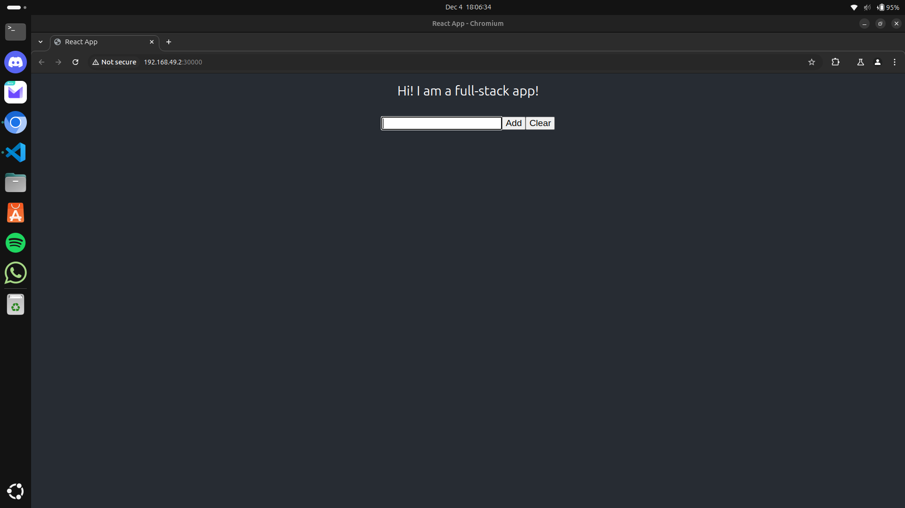

# Virtualization Project
Both tasks can be executed using the bash script `./Task_0X/setup.sh` (in sudo mode for Task_02).  
Successful outputs for both tasks can be found in `logs_setup_task0X.txt`.

## Task 01
This task required the installation of multiple packages (`conntrack crictl cri-dockerd`).  
In the first attempt, I tried to run minikube with no driver: `minikube start --driver=none`. This created issues, and it appeared I needed Docker as a driver to run the project. The next attempt didn't work out as minikube doesn't allow changing the driver this easily if it has already been started.  
Exploring solutions on the internet, I found the following issue https://github.com/kubernetes/minikube/issues/9399, which led me to add the option `--delete-on-failure`.  
Then on the next attempt, I got an issue with the backend pod stuck in CrashLoopBackOff.  
Without changes, another attempt was successful, and it was validated with the following screenshot:

## Task 02
This task was a bit more complicated. I tried to run the linked project but encountered some configuration issues. After making changes and trying different configurations using the latest version of the project, I finally chose to totally switch to the latest version. It then ran successfully, but the only issue was that my `setup.sh` script could not work on the first try as some containers took too much time to set up, which caused the start of the container `rfsim5g-oai-nr-ue` to fail.  
I also tried to configure DNS to allow pinging `www.lemonde.fr`; however, this wasn't successful. Hence, I opted for the second option to ping `192.168.72.135` as suggested by the project's [readme](https://gitlab.eurecom.fr/oai/openairinterface5g/-/tree/develop/ci-scripts/yaml_files/5g_rfsimulator#31-check-your-internet-connectivity).  
Finally, I managed to run this project successfully.